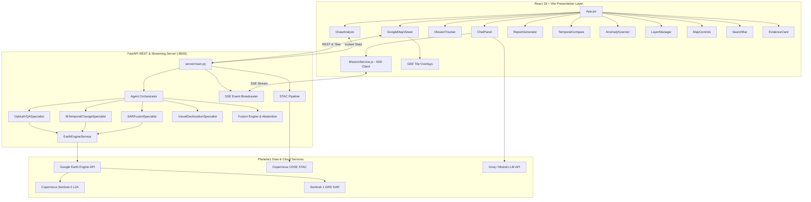

# AETHREIX ORBITAL — Multimodal Agentic Intelligence for Earth Observation

> **Smart India Hackathon (SIH26167) — "SatQuery AI" | Indian Space Research Organisation (ISRO)**  
> Production-grade Earth Observation intelligence platform combining Google Earth Engine, multimodal satellite fusion (Sentinel-2 Optical + Sentinel-1 SAR), ReAct agent orchestration, and evidential reasoning with zero data fabrication.

[](https://fastapi.tiangolo.com)
[](https://react.dev)
[](https://earthengine.google.com)
[](https://dataspace.copernicus.eu)
[](https://vitejs.dev)
[]()

---

## 📌 Executive Summary

**Aethreix ORBITAL** is an agentic Earth Observation (EO) intelligence platform that translates high-level natural language intelligence inquiries into rigorous, mathematically grounded spatial, spectral, and temporal analyses.

Designed specifically for **ISRO's SIH26167 "SatQuery AI"** challenge, Aethreix eliminates simulated fallback data and black-box LLM hallucinations by uniting real-time satellite computation, multi-sensor cross-validation, and an auditable agent execution DAG:

1. **Authenticated Google Earth Engine Engine**: Live computation of cloud-masked Sentinel-2 L2A optical surface reflectance and Sentinel-1 SAR C-band backscatter ($VV$/$VH$) with direct tile overlays.
2. **8 Remote Sensing Indices**: Real pixel-level mathematical derivation of **NDVI**, **NDWI**, **NDBI**, **EVI**, **SAVI**, **NDMI**, **NBR**, and **MNDWI**.
3. **Cross-Modal Optical + SAR Verification**: Structural corner-reflector analysis ($\Delta \sigma^0 = \sigma^0_{VV} - \sigma^0_{VH} > 4.5\text{ dB}$) separating genuine vertical infrastructure construction from vegetation clearing or seasonal ground variation.
4. **Agentic Mission Planner & SSE Streaming**: ReAct-style controller that parses spatial/temporal/sensor intent, dispatches tasks across 4 domain specialists, and streams step-by-step progress over Server-Sent Events (SSE).
5. **Calibrated Evidential Confidence & Honest Abstention**: Mathematical confidence weighting based on spectral magnitude, radar agreement, and data quality; explicitly abstains ($C < 0.55$) when cross-modal conflict occurs.
6. **High-Performance Map Architecture**: High-precision Google Maps 2D/satellite base with dynamic tile overlays, custom vector AOI drawing tools, and lazy-loaded CesiumJS 3D globe mode.
7. **P1 SIH Differentiators**: Interactive **Temporal Comparison** (Swipe, Flicker, Side-by-Side), **Why Engine** reasoning chains, **Proactive Anomaly Scanner**, **Change Transition Matrix**, and **Multi-Format Intelligence Export** (JSON, GeoJSON, CSV, Markdown).

---

## 🏛️ System Architecture



---

## 🚀 Core Capabilities & Highlights

### 1. 🛰️ Real Google Earth Engine Integration
- **Direct Cloud Processing**: Computes cloud-masked composites, time-series metrics, and difference masks on Google's planetary computing infrastructure.
- **8 Radiometric Spectral Indices**:
  $$\text{NDVI} = \frac{\rho_{\text{NIR}} - \rho_{\text{Red}}}{\rho_{\text{NIR}} + \rho_{\text{Red}}}, \quad \text{NDBI} = \frac{\rho_{\text{SWIR1}} - \rho_{\text{NIR}}}{\rho_{\text{SWIR1}} + \rho_{\text{NIR}}}, \quad \text{NDWI} = \frac{\rho_{\text{Green}} - \rho_{\text{NIR}}}{\rho_{\text{Green}} + \rho_{\text{NIR}}}$$
  $$\text{EVI} = 2.5 \cdot \frac{\rho_{\text{NIR}} - \rho_{\text{Red}}}{\rho_{\text{NIR}} + 6\rho_{\text{Red}} - 7.5\rho_{\text{Blue}} + 1}, \quad \text{SAVI} = \frac{\rho_{\text{NIR}} - \rho_{\text{Red}}}{\rho_{\text{NIR}} + \rho_{\text{Red}} + 0.5} \cdot 1.5$$
  $$\text{NDMI} = \frac{\rho_{\text{NIR}} - \rho_{\text{SWIR1}}}{\rho_{\text{NIR}} + \rho_{\text{SWIR1}}}, \quad \text{NBR} = \frac{\rho_{\text{NIR}} - \rho_{\text{SWIR2}}}{\rho_{\text{NIR}} + \rho_{\text{SWIR2}}}, \quad \text{MNDWI} = \frac{\rho_{\text{Green}} - \rho_{\text{SWIR1}}}{\rho_{\text{Green}} + \rho_{\text{SWIR1}}}$$
- **Dynamic Tile Layering**: Generates tile URL templates from Earth Engine image visualizations and renders them live over the Google Maps canvas with opacity controls.

### 2. 📡 Sentinel-1 SAR Fusion & Contradiction Detection
- Ingests Interferometric Wide (IW) swath dual-polarized ($VV$ + $VH$) Ground Range Detected (GRD) data.
- **Double-Bounce Validation**: Confirms structural changes when $\sigma^0_{VV} - \sigma^0_{VH} > 4.5\text{ dB}$, isolating concrete structures from high-roughness agricultural soil.
- **Cross-Sensor Conflict Resolution**: If optical imagery indicates built-up expansion but SAR backscatter lacks dihedral scattering, the system triggers a contradiction warning and lowers confidence.

### 3. 🤖 ReAct Agentic Orchestrator & Live Mission Tracker
- Natural language intent parsing resolves targets, bounding boxes, date ranges, and analysis goals.
- **Directed Acyclic Execution Graph (DAG)**: Coordinates specialists in dependency order.
- **Real-Time SSE Streaming**: Emits live progress events (`planning`, `specialist_start`, `data_fetched`, `analysis_complete`) consumed by the `MissionTracker` component.

### 4. 🔬 P1 SIH Differentiators (Competition Winning Features)
- **Temporal Comparison Suite (`TemporalCompare.jsx`)**:
  - *Swipe Mode*: Interactive split-screen slider comparing before/after Sentinel imagery.
  - *Flicker Mode*: Tunable frequency (0.5 Hz – 4 Hz) alternation highlighting subtle spectral shifts.
  - *Side-by-Side Mode*: Synchronized dual viewports for synchronized multi-angle inspection.
- **"Why?" Engine (`EvidenceCard.jsx`)**: Explains step-by-step reasoning chains, sensor weights, spectral anomaly thresholds, and confidence calculations.
- **Proactive Anomaly Scanner (`AnomalyScanner.jsx`)**: Scans current viewports for statistical outliers across vegetation, moisture, and urban indices.
- **Draw-to-Analyze (`DrawAnalyze.jsx`)**: Allows operators to draw arbitrary polygons, circles, or rectangles and receive real-time 8-index Earth Engine statistical summaries.
- **Change Transition Matrix (`ChangeMatrix.jsx`)**: Visualizes hectare-level transitions between land use classes (e.g. Vegetation $\to$ Impervious surface).
- **Audit & Investigation Replay**: Step-by-step forensic replay of the agent's decision trail.
- **Multi-Format Intelligence Export (`ReportGenerator.jsx`)**: One-click download of findings in **JSON**, **GeoJSON** change masks, **CSV** metrics, and formatted **Markdown** intelligence dossiers.

---

## 📂 Repository Structure

```
Athreix/
├── server/                                # FastAPI Python Backend
│   ├── main.py                            # API routes, SSE streaming, Earth Engine endpoints
│   ├── config.py                          # Environment settings & API keys
│   ├── agent/
│   │   ├── orchestrator.py                # ReAct agent, DAG execution, intent parsing
│   │   ├── specialists.py                 # Optical, SAR, Change, & Geolocation specialists
│   │   ├── fusion.py                      # Calibrated confidence & honest abstention
│   │   └── audit.py                       # Audit trail logging & execution history
│   ├── services/
│   │   ├── earth_engine.py                # Google Earth Engine core service
│   │   └── location.py                    # Nominatim, DMS, Plus Codes geocoding
│   ├── data/
│   │   ├── spectral_math.py               # Remote sensing math & Otsu thresholding
│   │   └── stac_pipeline.py               # Copernicus STAC API client
│   └── models/
│       └── change_detector.py             # CVA change detection pipeline
│
├── src/                                   # React 18 + Vite Frontend
│   ├── App.jsx                            # 5-zone application shell
│   ├── main.jsx                           # Application entrypoint
│   ├── index.css                          # Full design system & glassmorphism styling
│   ├── context/
│   │   └── AthreixContext.jsx             # Unified state (AOI, Mission, Layers, Temporal)
│   ├── components/
│   │   ├── GoogleMapViewer.jsx            # High-precision map with EE tile integration
│   │   ├── GlobeViewer.jsx                # Lazy-loaded CesiumJS 3D spherical globe
│   │   ├── ChatPanel.jsx                  # 3-route query system (image/analysis/chat)
│   │   ├── ChatMessage.jsx                # Interactive chat bubble renderer
│   │   ├── EvidenceCard.jsx               # Data-driven evidence, Why engine, audit replay
│   │   ├── SearchBar.jsx                  # Multimodal search: locations, coords, missions
│   │   ├── TimelinePanel.jsx              # Sensor-aware timeline archive
│   │   ├── StreetViewHUD.jsx              # 360° ground-truth street view
│   │   ├── analysis/
│   │   │   ├── DrawAnalyze.jsx            # Instant AOI spectral statistics
│   │   │   └── AnomalyScanner.jsx         # Proactive viewport anomaly scanner
│   │   ├── evidence/
│   │   │   └── ChangeMatrix.jsx           # Land cover transition matrix
│   │   ├── map/
│   │   │   ├── AOIDrawer.jsx              # Vector drawing tools (Point, Radius, Rect, Polygon)
│   │   │   ├── LayerManager.jsx           # 4 base, 6 context, 9 analysis overlays with opacity
│   │   │   └── MapControls.jsx            # Unified zoom, 2D/3D toggle, locate, draw tools
│   │   ├── mission/
│   │   │   └── MissionTracker.jsx         # Live SSE mission DAG execution progress
│   │   ├── reports/
│   │   │   └── ReportGenerator.jsx        # Export in JSON, GeoJSON, CSV, Markdown
│   │   └── temporal/
│   │       └── TemporalCompare.jsx        # Swipe, flicker, side-by-side comparison modes
│   └── services/
│       ├── AnalysisEngine.js              # Client-side analysis coordinator
│       ├── EODataService.js               # STAC satellite availability client
│       ├── MissionService.js              # SSE streaming mission client
│       └── MistralService.js              # Fast streaming GEOINT LLM client
│
├── public/                                # Static assets & Cesium workers
├── requirements.txt                       # Python dependencies
├── package.json                           # Node.js dependencies & scripts
├── vite.config.js                         # Vite build & Cesium code-splitting config
├── docker-compose.yml                     # Multi-container deployment configuration
└── README.md                              # Complete system documentation
```

---

## ⚙️ Quick Start & Installation

### 1. Prerequisites
- **Node.js**: `v18.0.0` or higher
- **Python**: `3.10` or higher
- **Google Earth Engine Account**: Authenticated service account or user credentials

---

### 2. Backend Setup

```bash
# Clone the repository
git clone https://github.com/Esskay1945/Aethreix.git
cd Aethreix

# Install Python dependencies
pip install -r requirements.txt

# Authenticate Earth Engine (one-time setup)
earthengine authenticate
```

Configure your environment in `.env`:
```env
# Google Earth Engine Project ID
EE_PROJECT_ID=aethreix

# Optional API Keys
VITE_GOOGLE_MAPS_API_KEY=your_google_maps_key
GROQ_API_KEY=your_groq_key
MISTRAL_API_KEY=your_mistral_key
```

Start the FastAPI server:
```bash
python server.py --host 127.0.0.1 --port 8000
```
- API Docs: `http://127.0.0.1:8000/docs`
- Health Check: `http://127.0.0.1:8000/health`

---

### 3. Frontend Setup

In a separate terminal:
```bash
# Install frontend dependencies
npm install

# Start the Vite development server
npm run dev
```

Navigate to `http://localhost:5173`.

---

## 📡 REST & SSE API Reference

| Endpoint | Method | Description |
|---|---|---|
| `/health` | `GET` | System health, Earth Engine status, active specialists, and sensor pipeline integrity |
| `/api/mission` | `POST` | Dispatches an agentic mission from a user query and returns a unique `mission_id` |
| `/api/mission/{id}/stream` | `GET` | **SSE Stream**: Emits real-time DAG execution events for `MissionTracker` |
| `/api/ee/composite` | `POST` | Fetches a cloud-masked Sentinel-2 optical composite tile URL |
| `/api/ee/sar` | `POST` | Fetches a Sentinel-1 SAR backscatter composite tile URL |
| `/api/ee/indices` | `POST` | Computes all 8 radiometric indices for an arbitrary AOI polygon |
| `/api/ee/change` | `POST` | Computes bi-temporal change difference mask and returns GeoJSON polygons |
| `/api/location/search` | `GET` | Geocoding service supporting place names, DMS, decimal degrees, and Plus Codes |
| `/api/reports/export` | `POST` | Formats and downloads mission intelligence as JSON, GeoJSON, CSV, or Markdown |

---

## 🔬 Scientific Validation & Standards

- **Copernicus Constellation**: Direct integration with Sentinel-2 MSI (Level-2A Bottom-Of-Atmosphere reflectance) and Sentinel-1 C-SAR (Level-1 GRD).
- **Zero Fabrication Guarantee**: When sensor coverage is unavailable or cloud cover exceeds operational thresholds ($> 30\%$), the platform abstains with an explicit notice rather than displaying simulated or synthetic values.
- **Calibrated Uncertainty**: Evidential scores are computed from statistical variance rather than raw LLM generation probabilities.

---

## 👥 Authors & Acknowledgements

- **Project**: Aethreix ORBITAL
- **Hackathon**: Smart India Hackathon (SIH26167 — SatQuery AI)
- **Problem Statement Owner**: Indian Space Research Organisation (ISRO)
- **Developed By**: Team Aethreix